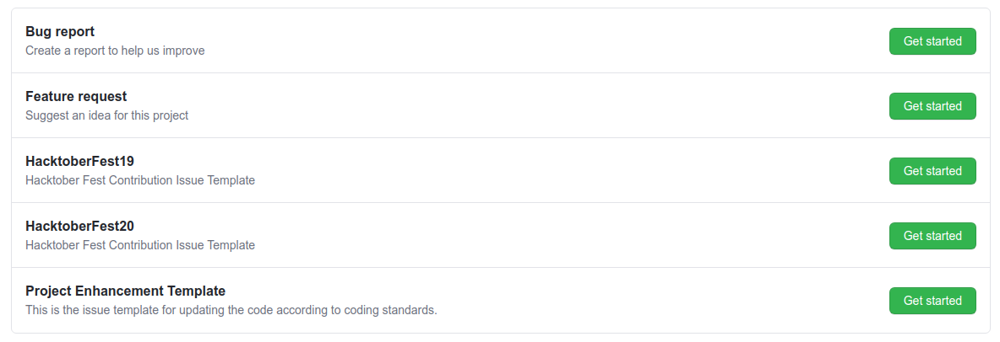

# CONTRIBUTION

* Please help us by making a star on our repository.

## HACKTOBER FEST (In October)

For contributing in October make sure first you read all these guidelines given below:

* Firstly read the README where we have all the algorithms added to this repository. Then you can decide yours which is not present.
* After making that decision check the [**Issue Templates**](https://github.com/TechOUs/Algorithms/issues/new/choose) and create the issue with *HacktoberFest< YEAR >* template. Then we can comment on the issue with the folder details where you can add your **Algorithm**.

* After creating the issue wait for the our reply then you can send us Pull Request.
* Wait for the response from our side and your PR and Issue will be linked by the maintainer.
* Also as per the new guidelines the Pull Request will first be approved then it will be marked at **hacktoberfest-accepted** label and then it will be merged.

## OUTSIDE HACKTOBER FEST (Other than October)

* Before contribution see through repository index and then open issue. (Duplicate code present in index will not be accepted)
* For doing contribution open an issue and tell us which program you like to add and in which language (use custom template for making issue).
* After opening issue we comment and then fork our repo and send us pull request.
* We make sure that pull request is merged ASAP if valid.

## DO

* Suggest a new language code in the issue.

## DON'TS

* Make an issue containing the program which already exists in our repository

## WARNINGS

* Pull Request will only be merged if you have created an issue we have commented on it to send us pull request
* Unnecessary pull requests will not be merged and are marked invalid.
